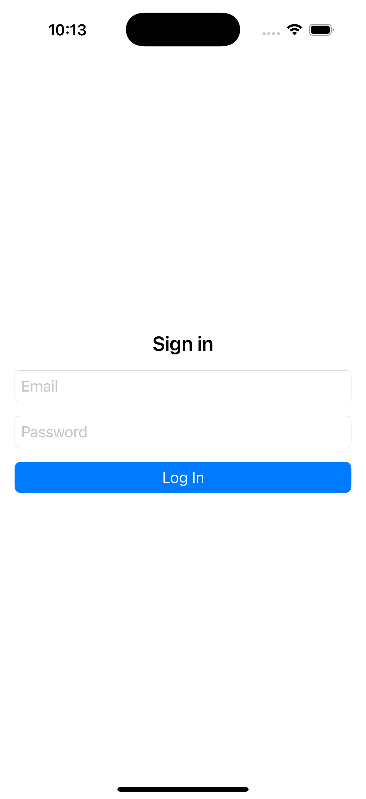
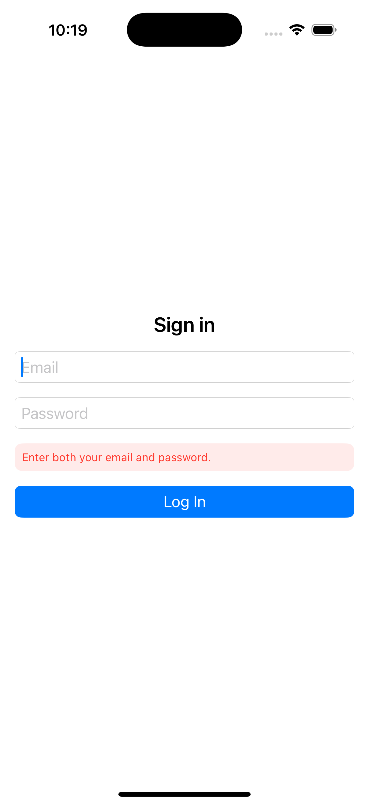
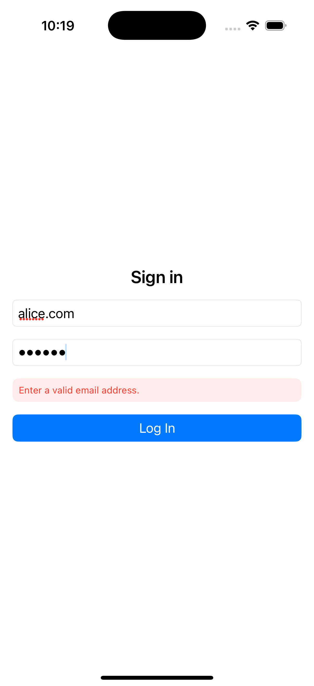
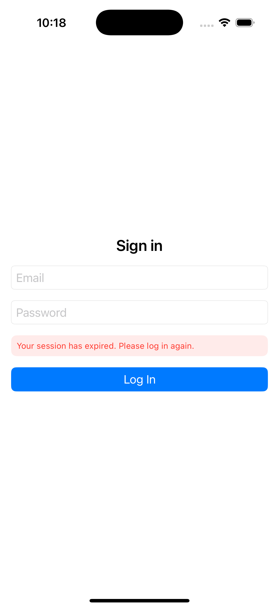
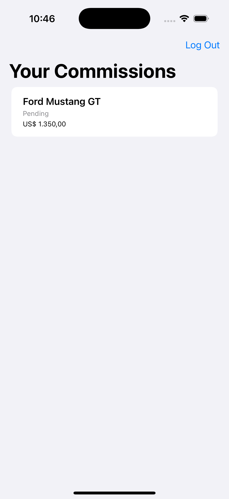
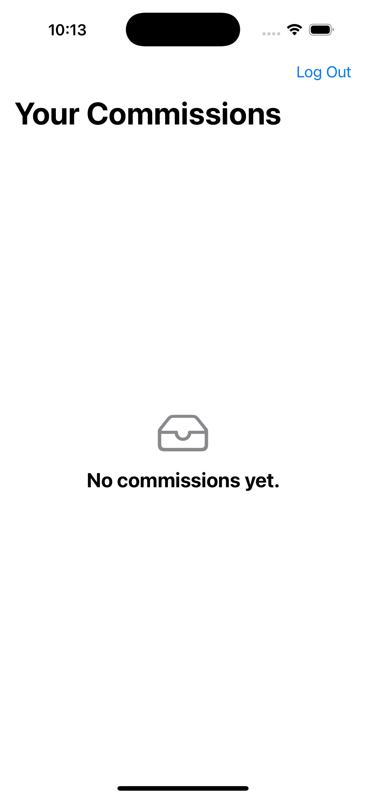
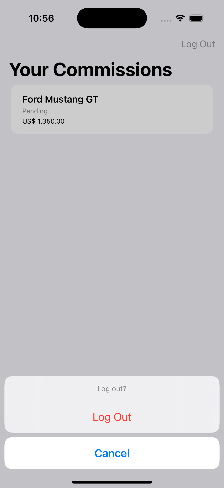

# AuthApp

iOS client for the DevMDS "Car Building Commissions API" test environment (`https://site.api-test.devmds.com`), built for a Swift developer technical assessment. Login, view your commissions, log out — with proper session handling and no shortcuts around security or testing.

## Requirements

- Xcode 16+
- iOS 18+
- Swift 6

## Setup

1. Clone the repo and open `AuthApp.xcodeproj`.
2. You'll need a test account for the API. Create `Secrets.local.xcconfig` at the project root (it's git-ignored, so it never gets committed) with:
   ```
   TEST_ACCOUNT_EMAIL = your.test.account@example.com
   TEST_ACCOUNT_PASSWORD = yourTestPassword
   ```
   Wire these into the scheme's environment variables if you want the login form pre-filled for manual testing. Don't hardcode them anywhere in source.
3. Build and run. Cmd+U for the test suite.

## The API contract

I verified this directly against the live Swagger UI (`/docs`) rather than assuming anything — the assessment specifically calls out not inferring undocumented fields, and a couple of things here genuinely aren't documented.

| Operation | Method & Path | Auth | Request Body | Success | Documented Errors |
|---|---|---|---|---|---|
| Login | `POST /auth/login` | none | `{ email, password }` | `200 { accessToken }` (JWT) | `401 { message, statusCode }` |
| List commissions | `GET /commissions` | Bearer | — | `200 [Commission]` | `401` |
| Get commission | `GET /commissions/{id}` | Bearer | `id` (path) | `200 Commission` | `404`, and in practice `401` too (marked "Undocumented" in the spec itself) |

Auth is a plain Bearer token: `Authorization: Bearer <accessToken>`.

A commission looks like this (observed from a live authenticated call — there's no schema for it in Swagger):
```json
{
  "id": "9ef0dc02-8133-4422-9dbc-bca38b156a79",
  "carModel": "Mustang GT",
  "carBrand": "Ford",
  "buildCost": "45000.00",
  "commissionRate": "3.00",
  "commissionAmount": "1350.00",
  "status": "pending",
  "createdAt": "2026-07-18T19:03:34.935Z"
}
```

A few things worth flagging about how this differs from what's documented:

- **There's no schema for `Commission` at all** in Swagger, only `LoginDto` and `AuthResponseDto`. The shape above came from an actual authenticated call during testing, not the docs. Decoding is written to tolerate that — an unexpected or missing field shouldn't take down the whole list.
- **The numeric-looking fields are strings**, not numbers (`"buildCost": "45000.00"`). Decoding them as `Double` would throw. They come in as `String` and get converted to `Decimal` further up, with a fallback if that ever fails.
- **`status` is an open-ended string.** Only `"pending"` has shown up so far, so it's modeled with a fallback case rather than a fixed enum — an unfamiliar value later shouldn't break decoding.
- **`GET /commissions/{id}` can return 401 even though the docs only list 200/404 for it.** Handled the same way as every other protected endpoint's 401.
- **There's no logout, register, or refresh endpoint**, even though the API's own description mentions "Register." Logout here just clears the local session (Keychain) — nothing is called on the server.
- **`createdAt` includes fractional seconds** (`"2026-07-18T19:03:34.935Z"`). A plain `.iso8601` date strategy doesn't accept those milliseconds and fails to decode — caught by testing against a real account where every commission has this exact timestamp shape and the list came back empty with no visible error, thanks to the lenient list decoding hiding the failure. The decoder now tries with fractional seconds first, then falls back without.

## Architecture

Clean Architecture-ish, MVVM-C on top:

```
App/        composition root + coordinator
Core/       networking, session, error types, utilities — no UI, no feature-specific logic
Shared/     reusable UI components and design tokens
Features/   one folder per feature — View / ViewModel / Repository / Models / Services / Coordinator
Tests/      mocks, fixtures, and test suites
```

The rule that matters most: Views only know about ViewModels, ViewModels only know about repository protocols, repositories only know about `APIClientProtocol`, and `APIClient` is the only thing that ever touches `URLSession`. No singletons — everything gets passed in through initializers.

A few pieces worth knowing about in `Core/Networking`:

- **`HTTPRequestBuilder`** is the one place a `URLRequest` gets assembled, including the `Authorization` header. Worth calling out because of something that actually happened while verifying the API by hand: pasting a token with its surrounding quotes into Swagger's "Authorize" field produced `Authorization: Bearer "eyJ..."`, and the API correctly rejected it. Having exactly one code path build that header rules out that whole class of bug, and there's a test (`attachesAuthorizationHeader`) asserting the header comes out clean.
- **`NetworkError`** is a closed set of failure cases (transport, HTTP status, decoding, unauthorized, etc.) with no user-facing copy in it — that's a separate layer's job, so this type can stay dumb and just classify what happened.
- **`AuthorizationInterceptor`** is how `APIClient` gets a bearer token without knowing Keychain or any session state exists. Right now it's a no-op (login doesn't need a token); the session layer plugs in here once it exists.
- **`RetryPolicy`** only retries actual connectivity failures, never HTTP errors or bad JSON — retrying a 401 wouldn't accomplish anything except delay telling the user it failed.
- **`Logger`** wraps `os.Logger` and refuses to emit anything marked sensitive outside of a masked placeholder, even in debug. It's the only thing in the app allowed to log at all.

### Session lifecycle and 401s

`SessionManager` is the single source of truth for whether the app shows Login or the commissions list. The one subtlety worth explaining: a 401 means different things depending on where it comes from. `AuthRepository` maps it to "wrong credentials," while `CommissionsRepository` maps the exact same `NetworkError.unauthorized` to "your session is no longer valid" — there's no way for the networking layer itself to know which meaning applies, so each repository decides based on its own context.

When `CommissionsViewModel` sees a session-expired error, it hands off to `SessionManager.handleUnauthorizedResponse()`, which clears the Keychain and routes back to Login with an explanation, rather than leaving the user staring at a blank error. Logout works the same way minus the "why": it clears the stored token and returns to Login directly, after a confirmation dialog.

## Testing

Uses Swift Testing rather than XCTest — mostly a readability preference, XCTest would've worked fine too. Everything runs against a stubbed `URLProtocol`, never the live API, so the suite is deterministic and doesn't care whether the API happens to be up.

Covered so far:
- successful decode of a login-shaped response
- 401 → `NetworkError.unauthorized`
- an unexpected status code (500) → `NetworkError.http`
- a malformed body → `NetworkError.decoding`, without crashing
- a protected call with no token available fails immediately, no network call made
- the Authorization header is well-formed (no stray quotes — see above)
- a commission list decodes into domain models, with money fields converted from string to `Decimal`
- one malformed entry in a commission list is dropped without failing the rest of the list
- a 401 while fetching commissions maps to session-expired, not invalid credentials
- session-expired clears the stored token and routes back to Login
- logout clears the stored token independently of any server response
- the real Keychain round-trips a token correctly (save/load/clear/overwrite) — this one runs against actual Security framework calls, not a mock
- `RetryPolicy` retries transport failures only, stops at its max attempt count, and backs off correctly (300ms → 600ms → 1200ms)
- `LoginCredentials.validate()` catches empty fields, whitespace-only input, and a missing `@`
- `AppError.mapping()` is covered exhaustively across every `NetworkError` case
- an unparseable commission amount maps to `nil`, not `0` and not a crash

54 tests total, all passing, all offline.

### Running tests from the command line

```
xcodebuild test -scheme AuthApp -destination 'platform=iOS Simulator,name=iPhone 16'
```

(Cmd+U in Xcode is what I actually used day to day — this is just the equivalent for CI or a reviewer who'd rather not open the IDE.)

## Security

- **Keychain, not UserDefaults**, for the session token. `KeychainSessionStore` is the only thing that touches it, using `kSecAttrAccessibleAfterFirstUnlockThisDeviceOnly` — restoration works from a background launch, not only while the device is actively unlocked, but the item stays device-only and is never part of an iCloud Keychain sync or restored onto a different device.
- **The password itself is never persisted anywhere.** Only the access token from `/auth/login` reaches Keychain; the password lives in `LoginCredentials` for the duration of one submit and then is gone.
- **`Logger` refuses to emit anything marked `sensitive`** outside of a masked placeholder, in debug and release alike — the Authorization header and request/response bodies never get logged in the clear.
- **Nothing is `public`.** This is a single app target, not a framework — there's no boundary access control needs to protect, so everything defaults to `internal`.

## Tradeoffs

A few deliberate departures from a literal reading of the brief, each made for a specific reason:

- **"Commissions," not "Profile."** The template folder structure names the second feature "Profile," but the actual protected resource this API exposes is `/commissions`. The feature is named for what it does, not for what the template assumed it'd be.
- **Logout is local-only.** There's no logout endpoint in the API (see "The API contract"), so `SessionManager.logout()` clears the Keychain and resets state without a network call. Adding a real server-side logout later is one more repository method, not a redesign.
- **`RetryPolicy` retries transport failures only.** Retrying a 401 or a malformed 200 just delays telling the user about a failure that's going to repeat identically — only genuinely transient failures get a second attempt.
- **No commission detail screen, no `CommissionsCoordinator`, no separate `CommissionMapper` type.** Each would have been code with no caller yet — the list screen alone satisfies the "protected user data" requirement, and a mapping function small enough to live as `Commission.init(dto:)` didn't earn its own type.

## Screenshots

**Login**



**Login — validation errors**




**Session expired**



**Commissions list**



**Commissions — empty state**



**Logout confirmation**



## Known limitations

- No documented schema for `Commission`, so decoding is defensive rather than guaranteed to hold up against future changes to the API.
- No server-side logout, registration, or refresh endpoint exists right now — logout only clears what's stored locally.
- A stored token means "this device was logged in before," not "this token still works" — validity only gets confirmed the next time a protected call is actually made.
